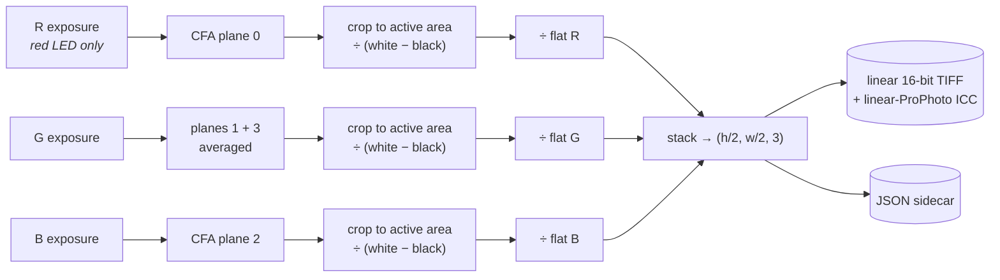

# CLAUDE.md

This file provides guidance to Claude Code (claude.ai/code) when working with code in this repository.

## Setup

```bash
python -m pip install -e .
```

Dependencies: `rawpy`, `tifffile`, `pyexiv2`, `numpy`, `pyserial`, `scipy`. Python 3.11+ — that floor comes from numpy/scipy/tifffile, which is why it can't go lower; development and CI run 3.14 (see `.tool-versions`), so 3.14 is the only version formally tested. The optional `gphoto` extra (`pip install -e ".[gphoto]"`) adds python-gphoto2, needed only for `--camera-backend gphoto2`; it also needs `libgphoto2` on the system.

**Do not loosen the version floors in `pyproject.toml`.** `numpy`, `scipy` and `rawpy`
are floored at the first release shipping official wheels for every supported Python,
and that is a correctness constraint, not tidiness. Unfloored, `pip install -e .` on
3.14 accepted an already-installed numpy 2.2.1 — a release predating 3.14 by a year,
which pip had earlier built from source because no wheel existed. The resulting numpy
returned silently wrong answers from `scipy.ndimage`: `measure_leader_level` read
1008232 where it should read 1000, with arrays reading back values that could not
coexist (a buffer holding squared values while the variance computed from it was
correct). Nothing raised. Since that function sets the exposure target for a whole
roll, it would have mis-exposed every frame rather than failing.

The floors matter because pip leaves an *already-satisfied* requirement alone: with no
floor a stale broken numpy survives `pip install -e .`, and with one it gets upgraded.
Only the three that link numpy's C ABI carry floors; the rest are pure Python or do not
touch numpy.

To check an environment is sound, run the test suite — `test_leader.py` is what caught
this, and it fails loudly on a broken stack. To verify no dependency needs a source
build at all:

```bash
python -m pip install --only-binary=numpy,scipy,rawpy -e ".[dev]"
```

## Hardware

Sony A7R V, Sigma 105mm f/2.8 DG DN Macro (manual focus, f/8), JackW Big ScanLight
(narrowband RGB LED, RP2040) over USB serial, Negative Supply 35mm MK2 holder on a
Kaiser RS1 copy stand.

**Capture One owns the camera.** It holds the tether for live view and focus
magnification, writes the ARWs, and fires the shutter on our behalf via AppleScript.
Sony's PC Remote connection allows one controlling host at a time, so driving the
camera directly (gphoto2, CRSDK) generally means losing the live view that focusing
depends on. The ScanLight's own shutter trigger isn't usable on Sony bodies either.
`--camera-backend gphoto2` drives the camera directly as a fallback, but gphoto2's
Sony support is reverse-engineered per body and there's an unresolved capture failure
reported against the ILCE-7RM5 — prefer the Capture One path.

Trichromatic (3-shot): fire red, green, blue in sequence and merge the clean
per-channel exposures — no crosstalk to correct, since only one narrowband LED is
ever on at a time.

## Running the tool

One command, launched once per roll:

```bash
trichrom-scan --session-dir /path/to/session --watch-dir /path/to/captures \
    --film-stock "Portra 400" --roll-id roll01
```

`--output-dir` defaults to `--watch-dir` (merged TIFFs land next to the ARWs); pass
it explicitly to write merged TIFFs somewhere else. `--camera-backend` selects how the
shutter fires — `captureone` (default) or `gphoto2`.

A brand-new `--session-dir` (or `--recalibrate`) runs calibration first: ~5 minutes
of LED warm-up, per-channel flats (holder off, bare light), then a leader-based
two-pass channel balance + shutter-speed exposure targeting. Resuming an
already-calibrated session skips straight to the capture loop:

```bash
trichrom-scan --resume --watch-dir /path/to/captures
```

`--resume` (or an explicit `--session-dir` pointing at an existing session) reuses
the saved calibration and flats; if that calibration is more than a few hours old
you're asked whether to redo it rather than it being silently trusted. Per frame:
advance the film, check framing in Capture One's live view, press Enter (terminal
or footswitch). The three exposures fire in sequence, merge into a linear 16-bit
TIFF, and per-channel peaks print as a drift check. A JSON sidecar with calibration
numbers, shutter speed, raw peaks, and source filenames is written next to every
merged TIFF.

## Tests

```bash
python -m pip install -e ".[dev]"
python -m pytest
```

(`python -m` rather than the bare `pytest` script guarantees the tests run under the
same interpreter the dependencies were installed into.)

Tests cover the pure logic that fails *silently* — merge math, the ICC profile, leader
measurement, shutter selection, flat-field build, session state. No hardware, no ARWs,
sub-second. The camera backends and capture loop are deliberately untested: without a
camera attached there's nothing meaningful to assert. No linting is configured.

For those untested paths, `--dry-run` is the other lever: it walks the full flow (new
session → calibration → capture loop, plus `--resume` and `--recalibrate`) without
touching hardware, so it catches wiring and argument regressions the unit tests can't
see. Run it on both backends after changing anything in `scan.py`.

Synthetic raw frames in tests should use **nonzero** sensor margins. Real bodies have
them; zero-margin fixtures hide active-area crop mismatches, which is exactly the class
of bug that passes here and breaks at the rig.

When adding tests, check they actually catch a regression — break the thing on purpose
and confirm the relevant test fails.

Gotcha when doing that by mutating a *copy* of the source tree: `pyproject.toml` sets
`pythonpath = ["src"]` under `[tool.pytest.ini_options]`, and that wins over the
`PYTHONPATH` environment variable — so `PYTHONPATH=/tmp/mut python -m pytest` silently
tests the real `src/` and every mutation "passes." Override the setting instead:

```bash
python -m pytest -o pythonpath=/tmp/mut
```

## Project structure

```
src/trichrom/
├── lib/
│   ├── scanner.py       # Scanlight serial control + ARW file watching
│   ├── captureone.py     # camera backend: shutter + settings via C1 AppleScript (default)
│   ├── gphoto.py         # camera backend: direct camera control via gphoto2
│   ├── shutter.py        # shutter-speed parsing/selection shared by both backends
│   ├── rawio.py          # rawpy read + Bayer plane extraction helpers
│   ├── leader.py         # film-base density measurement (variance-masked, percentile)
│   ├── flatfield.py       # per-channel flat-field build + apply
│   ├── icc.py             # minimal linear-ProPhoto ICC profile builder
│   ├── merge_tri.py       # merge pipeline -> linear TIFF + JSON sidecar
│   └── session_state.py   # session.json persistence, resume, staleness warning
└── scan.py               # calibrate (if needed) + capture + merge (trichrom-scan)
```

## Architecture

**`scan.py`** — `main()` decides whether calibration runs: a brand-new session dir,
`--recalibrate`, or a session with no recorded calibration all force it; a stale
(`>4h`) calibration on an otherwise-calibrated resumed session prompts
interactively. Calibration itself is two passes, not an iterative search: pass 1
(`balance_channels`) shoots one exposure per channel at a known starting power and
computes the balance ratio directly (LED output is roughly linear with drive
current) — the two stronger channels scale down to match the weakest, never up.
Pass 2 (`adjust_exposure`) holds channel balance fixed and adjusts shutter speed
alone, picking the nearest camera-supported shutter value by ratio each iteration,
capped at `--max-exposure-iterations`.

Flats come before both passes (`capture_flats`, holder off, bare light, averaged
over `--flat-shots` exposures per channel), and that ordering is forced: the leader
readings both passes depend on are themselves flat-corrected. Which means the flats
are shot *before* a shutter speed exists, so LED power — not shutter — is the
exposure lever for them. `_probe_flat_power()` shoots one bare-light frame per
channel, reads it with `flat_level()`, and scales power by direct ratio to land near
`FLAT_TARGET`; the real flats then follow at that power. Same reasoning as pass 1:
LED output is roughly linear with drive current, so no search loop is needed.

Before any of it, `warm_up()` cycles R/G/B one channel at a time at
`--start-power`. Cycling is the point, not incidental: scanning only ever has one
narrowband LED lit, so warming all three (or any of them at full power) settles the
board hotter than it ever gets in use, and calibrating against that overshoot means
the light cools toward its real operating point across the roll — the same drift
warm-up exists to prevent, with the sign flipped.

The capture loop (`run_capture_loop`) then fires R/G/B per frame and merges via
`lib/merge_tri.py`. Between frames it drops to `set_preview_light()` so the operator
can see the frame while advancing film; without that the light would sit on whichever
channel fired last. Hardware (Scanlight + camera) connects once and is shared across
both phases.

All three of those go through `light_channel()` / `set_preview_light()` rather than
raw `set_color()` calls, so "exactly one channel lit" stays a single decision.

Two conventions in the shooting helpers. `_shoot()` returns `None` on any failure
(no file appeared, or it never settled) — in the capture loop that means one bad
frame, logged as `incomplete` and skipped. Calibration can't shrug that off, so it
calls `_require_shot()` instead, which turns a `None` into `sys.exit` with a message
naming the phase; the alternative is a `None` deref surfacing several frames later
inside rawpy. Both are no-ops under `--dry-run`, which returns `None` by design.

**`lib/leader.py`** — measures the film-base signal robust to loose leader
positioning: samples a central band, computes local variance via a single-pass
`uniform_filter` on values and values-squared, masks out the highest-variance
fraction (image content and frame edges, since base is smooth), Gaussian-blurs to
average out grain, then takes a high percentile (dust/hot pixels can't set the
target).

**`lib/flatfield.py`** — averages several per-channel exposures, extracts the
matching Bayer plane(s) (green averages G+G2), crops to the active sensor area
through the same `extract` + `crop_half_res` path the signal uses (so flat and
frame are the same shape — sensor margins are nonzero on real bodies), heavily
smooths with `uniform_filter` to kill flat-field grain without a polynomial model,
and normalizes so the brightest point is 1.0.

Only the flat's *shape* is used, but the exposure it was shot at still decides
whether that shape is any good: a clipped flat has a flat-topped falloff and
under-corrects vignetting across the whole roll, and a dark one divides its own read
noise into every frame. Neither announces itself in the output, so `build_channel_flat`
raises outside `[FLAT_MIN, FLAT_MAX]` rather than returning a quietly bad flat.
`flat_level()` reports the same fraction-of-usable-range measure for the probe in
`scan.py` that aims at `FLAT_TARGET`.

**`lib/merge_tri.py`** — for each of the three exposures, extracts only the
matching CFA plane (red from the red exposure, etc.; green averages G+G2),
normalizes by `(white_level - black_level)`, divides by that channel's flat, and
stacks into a linear TIFF.

`--resolution` picks what happens next, and the distinction is worth holding onto:
three-shot removes the *spectral* mixing between channels but not the *spatial*
sparsity of the CFA. Red is measured at a quarter of the photosites no matter which
LED is lit, so the two options are `half` — emit one pixel per measured photosite,
`(h/2, w/2, 3)`, nothing interpolated — or `full` (default), which reconstructs each
channel from its own measured sites up to `(h, w, 3)`. `full` is a cleaner
reconstruction than demosaicing a single Bayer frame, since no channel has
contamination from the others to unpick, but it is still interpolation. Which one
produced a file is recorded in the TIFF metadata and the sidecar; that is provenance,
not trivia, since it decides what the file can honestly be compared against.

Measured ~4s per frame at full resolution against ~0.6s at half on an Apple-silicon
Mac, TIFF write included, for a 61MP frame. Note that a CI/container box measured
roughly 3x slower — quote the machine along with the number.

The per-channel drift peak is taken from the measured photosites, before any
reconstruction. That keeps it meaning the same thing at either `--resolution` (so
peaks stay comparable across a roll shot both ways) and reads a quarter as much data.



The three columns never mix — that is the whole point of shooting trichromatically.
There is no crosstalk term because no pixel ever saw two LEDs, and no demosaic step
because every output pixel is one real photosite rather than an interpolation of its
neighbours.
Unity white balance throughout: the camera's per-channel as-shot WB guess is
recorded in metadata as documentation only, never applied. No lens/vignetting
correction and no DCP/camera color matrix — sensor space is preserved for
downstream color work in Capture One.

**`lib/icc.py`** — hand-built minimal ICC v4 matrix/TRC profile: ProPhoto RGB
primaries (D50 native white point, no chromatic adaptation needed), computed
RGB→XYZ matrix via the standard primaries+whitepoint derivation, and a `curv` TRC
tag with zero curve points (the ICC-spec encoding for an identity/linear
response).

**Camera backends** — `scan.py` reaches the camera through six functions
(`open_camera`, `close_camera`, `trigger_and_wait`, `get_shutter_speed`,
`get_shutter_choices`, `set_shutter_speed`) implemented by both `lib/captureone.py`
and `lib/gphoto.py`. `--camera-backend` picks one; `main()` resolves it once and
stashes the module on `args.cam`, which is already threaded through every function
that touches the camera, so call sites read `args.cam.trigger_and_wait(...)`.

**`lib/captureone.py`** (default) — drives C1 over `osascript`. `trigger_and_wait()`
runs `tell application "Capture One" to capture`; C1's capture is asynchronous, so it
only confirms the command was accepted and the caller's `wait_for_new_file()` remains
the signal that matters. `shutter speed of camera of current document` is confirmed
readable; whether C1 exposes it as *writable* is undocumented and may vary by body, so
`set_shutter_speed()` falls back to prompting the operator to dial it in if the write is
refused — a once-per-roll calibration step, never in the per-frame path.
`get_shutter_choices()` tries `available shutter speeds` and falls back to the standard
ladder in `lib/shutter.py`. Shutter values are checked for quote/backslash before being
interpolated into AppleScript.

**`lib/gphoto.py`** — `trigger_and_wait()` fires the shutter and blocks on
`wait_for_event()` for `GP_EVENT_CAPTURE_COMPLETE`/`GP_EVENT_FILE_ADDED` rather
than a fixed sleep (too-fast sleeps are the classic source of truncated
captures). Shutter speed is read/set via the camera's `shutterspeed` config
widget. Its import is guarded, so the package works without python-gphoto2 installed.

**`lib/shutter.py`** — `nearest_shutter_choice()` picks the closest available value to a
target duration on a log scale, since shutter steps are geometric; `STANDARD_CHOICES` is
the 1/3-stop ladder used when a backend can't report the camera's own list.

**`lib/session_state.py`** — `session.json` lives in the session folder so
provenance travels with the roll if it's moved or archived. A separate small
pointer file (`~/.trichrom/last_session`) records the most recently used session
dir for `--resume`; losing it costs convenience. Per-frame status is recorded so a
mid-roll merge failure identifies exactly which frames need redoing.

**`lib/rawio.py`** — rawpy read plus the Bayer plane helpers. `upsample_bayer_plane()`
carries the full-resolution path, and three things in it are load-bearing rather than
incidental, each found by a test that failed first:

- **Per-site offsets.** R, G, G2 and B sit at four different corners of the 2×2 cell.
  Interpolating each as though it began at (0, 0) leaves the finished channels shifted
  half an output pixel against each other — colour fringing on every edge of every
  frame, and no error anywhere. `active_site_offsets()` also folds in `margin % 2`, so
  an odd active-area margin shifts the phase correctly instead of silently.
- **Odd-reflection padding.** Cubic splines ring at an array boundary (a linear ramp
  reconstructs its first interpolated sample at 0.84 where it should read 1.0), and the
  output grid runs half a sample past the last measured site, where clamping would hold
  the edge value. Padding with `reflect_type='odd'` continues the edge gradient and
  fixes both; padding with `'edge'` does not — a constant extension makes the spline
  bend exactly where the real data starts.
- **Two fixed kernels, not a general resampler.** The scale factor is exactly 2, so
  every output sample lands either on a spline coefficient or exactly halfway between
  two. Evaluation is therefore `KERNELS` — the B-spline basis at those two positions —
  applied as separable slice arithmetic over `spline_filter` coefficients. Both general
  evaluators were tried and both lost badly: `map_coordinates` wants a meshgrid of two
  float64 arrays the size of the output (near a gigabyte at 61MP), `RectBivariateSpline`
  spends more time in its fit than this whole routine takes, and `affine_transform` —
  which looks like the natural fit — was slower than either. All agree to ~5e-7.

  A caution for anyone testing this: a **linear** ramp is invariant under the
  approximating filter `[1, 4, 1] / 6`, so a reconstruction that skipped the spline
  prefilter entirely still reproduces a ramp perfectly. Only a curved field separates
  interpolation from approximation, which is what `test_measured_sites_survive_a_curved_field`
  is for.

  At this array size **allocation dominates arithmetic**, so both the kernel
  accumulation and the uint16 scaling write in place — into the output slice and one
  reusable scratch buffer. The natural spellings (`acc = acc + weight * chunk`,
  `clip(...) * 65535 + 0.5`) each allocate a couple of full-size temporaries per tap or
  per channel, which is up to seven arrays of 60MP for the four-tap kernel and measured
  ~35% of total merge time. Prefer in-place `np.multiply(..., out=)` and `+=` anywhere
  in this path; the readable version is not free here the way it usually is.

`verify_channel()` in the same module answers a question nothing else in the pipeline
asks: was this frame really lit by the LED we think it was? Everything downstream keys
off filename-to-channel attribution, and that rests on `wait_for_new_file()` returning
the right file per trigger. Get it wrong and the merge writes a valid, sharp,
correctly-exposed TIFF with two channels exchanged, raising nothing — you find out
part-way through inverting a roll. Under one narrowband LED a single Bayer colour
stands far above the others, so the argmax settles it with no calibration needed.

It runs in two places, following the `_shoot`/`_require_shot` convention: inside
`merge_triplet()`, where the raws are already open so it costs nothing and a raise
becomes one failed frame; and via `_read_verified()` on the calibration path, where it
is fatal, because a mis-attributed calibration frame does not spoil one image, it
quietly mis-exposes the whole roll. Order of checks matters — black, then dominance,
then identity: at low signal or under white light the argmax is decided by noise, so
naming a channel would mislead rather than inform. `MIN_DOMINANCE` is deliberately
conservative at 2.0; the true CFA ratio is far higher but has never been measured on
this body, and the threshold's real job is separating one-LED light from the
white-equivalent preview level, which sits near 1. The measured ratio goes into the
sidecar, so a roll drifting toward 1 is visible after the fact.

**`lib/scanner.py`** — Scanlight serial protocol (custom binary packets over
pyserial) and ARW file watching. The Bayer channel index mapping is 0=R, 1=G, 2=B,
3=G2 (second green in RGGB); black/white levels and active sensor area margins are
read directly from source files — no camera-specific hardcoding.

Note that `wait_for_new_file()` returns as soon as a new ARW's name appears and
picks arbitrarily if more than one is present, so `_shoot()` in `scan.py` calls
`wait_for_settle()` before returning the path. That settle does double duty: it
guarantees the file is fully written before anything reads it (calibration, flats,
and merge all read through this one path), and by holding until the file is done it
keeps one trigger mapped to one file, which is what keeps filename→channel
attribution correct.

`wait_for_settle()` returns a bool, and a `False` must never be treated as success —
a timeout means the file is most likely still being written, which is the exact case
the guard exists to catch. `_shoot()` therefore discards the path and returns `None`;
losing one frame beats merging a truncated raw.

That settle makes correct attribution *likely*; it cannot guarantee it, which is why
`verify_channel()` reads it back from the pixels — see below.

## Open items

The code paths that touch Capture One and the camera cannot be exercised without the
rig (macOS + C1 + tethered A7R V), so the following are unverified against real
hardware. The Capture One backend is written to the documented AppleScript surface
but has only been dry-run tested.

**Verify before the first real roll** (all quick checks at the rig):

1. **Trigger fires.** `tell application "Capture One" to capture` actually releases the
   shutter on the A7R V with C1 tethered. Known to work on an A7 III; unverified on
   this body. If it fails, see the fallback below.
2. **`capture` must not autofocus.** AF on a flat negative is unreliable and, worse,
   firing it between the three exposures shifts focus across channels — the spec's
   "no autofocus, ever." A community remote-trigger script initiates AF as an
   *explicit separate step*, which implies plain `capture` does not focus, but confirm
   the lens doesn't hunt on a bare `capture`.
3. **`capture` coexists with continuous live view.** We keep live view up for the whole
   roll (for focus magnification); a common community script instead opens live view,
   shoots, and closes it each time. Confirm capture works without closing live view.
4. **Is `shutter speed` writable?** Capture One → Scripts → Open Scripting Dictionary →
   `camera` class: `shutter speed (text)` means settable, `(text, r/o)` means read-only.
   If read-only, nothing breaks — `set_shutter_speed()` already degrades to prompting
   the operator during calibration — but you'll dial shutter speed by hand each pass-2
   iteration. Reading it is already confirmed to work.

**Fallback if the C1 trigger doesn't work:** `--camera-backend gphoto2` drives the
camera directly, but there's an open unresolved gphoto2 capture failure against the
ILCE-7RM5 (gphoto2 issue #676), so it may not work either. Next candidate is Sony's
**Camera Remote Command** (official CLI, macOS) before CrSDKPy (which needs a
self-built C++ bridge and is Windows-tested only).

**Fast-follow, only if warranted:** replace the poll-and-settle file detection with a
Capture One Background Script bound to `CO_CaptureDone(rawFilePath)`, which hands us
the captured file's path directly — eliminating the folder race and the settle
guesswork (see the `lib/scanner.py` note above). The mechanism is undocumented and it
is unverified whether it fires *after* the file is fully written, so keep the settle
check as a guard. Worth doing once the trigger path is proven, or sooner if
`wait_for_new_file` + settle proves flaky in practice.

**EXIF embedding is unverified but non-fatal.** Whether pyexiv2 writes the preserved
EXIF cleanly into the tifffile-produced TIFF — and whether the `Exif.Sony2.*`
MakerNote tags survive into a non-ARW container at all — can't be tested without a
real ARW. `_preserve_exif` now catches a write failure and continues (the JSON
sidecar carries authoritative provenance either way), so a bad tag costs the embedded
EXIF, not the frame. If the Sony MakerNote tags prove troublesome at the rig, drop
them from `_PRESERVED_EXIF_KEYS`. `Exif.Image.Orientation` is deliberately not
preserved — a copy-stand scan is rotated/cropped downstream in Capture One.

**Minor code notes** (deliberately left as-is): `adjust_exposure` uses the R channel's
black level for all three channels' usable-range math — harmless while the A7R V
reports equal black levels across channels. A mid-roll merge failure prints the
exception message but not a traceback.
