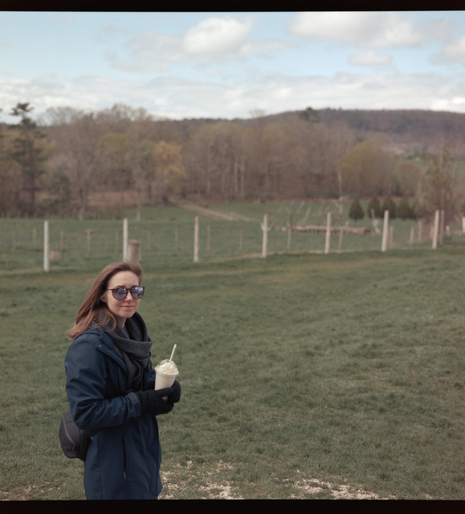
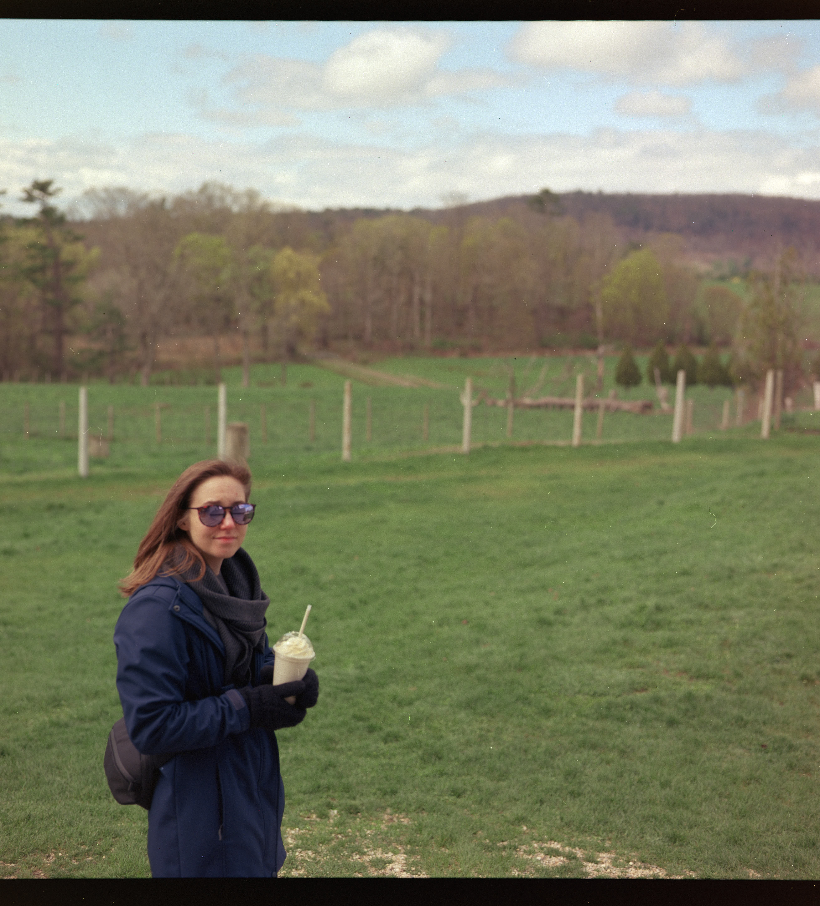
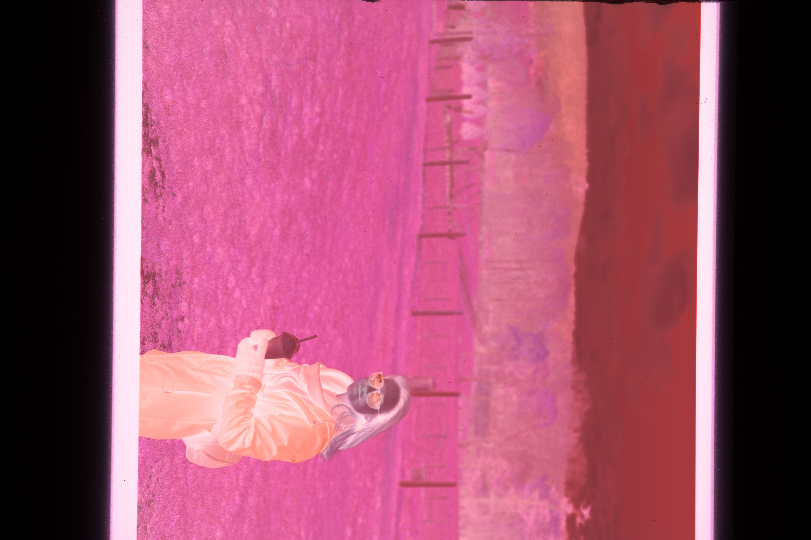
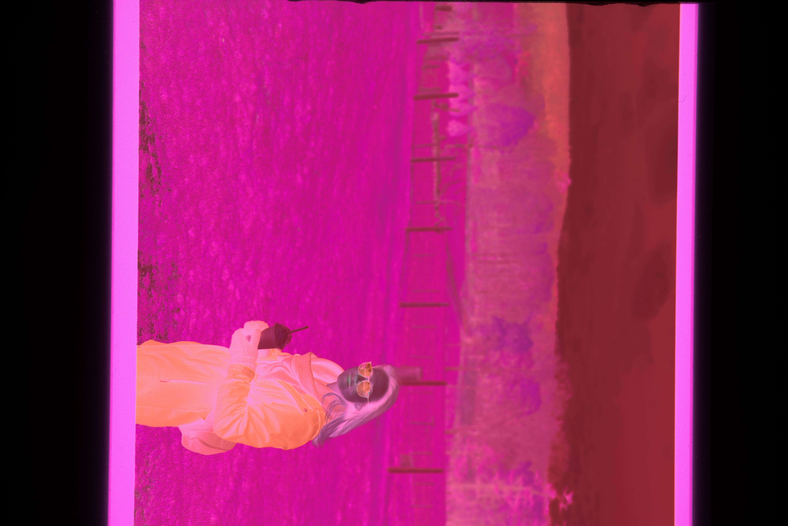
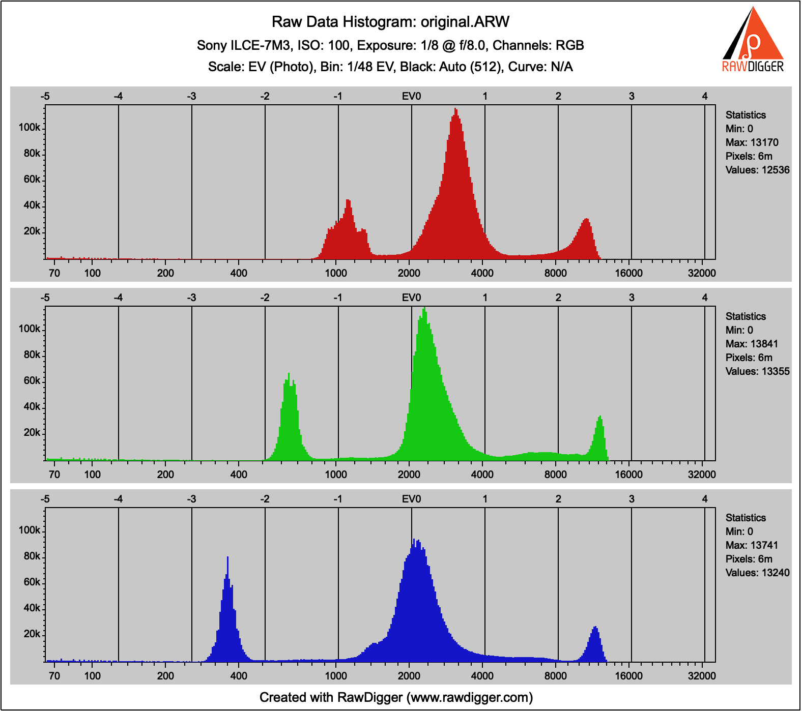
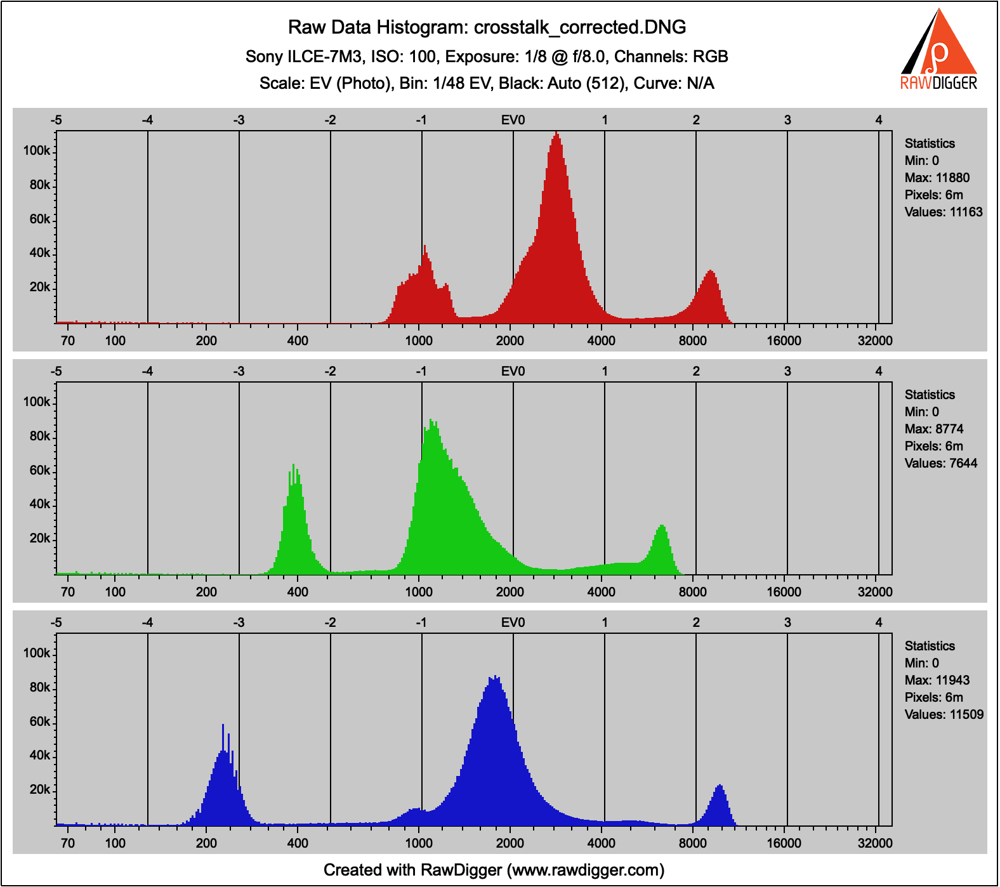
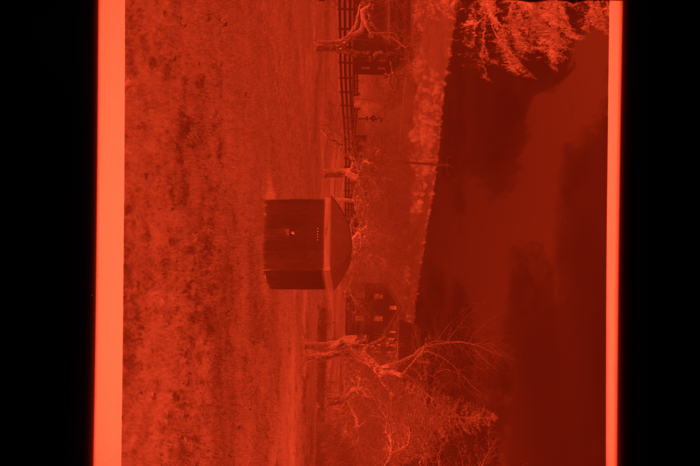
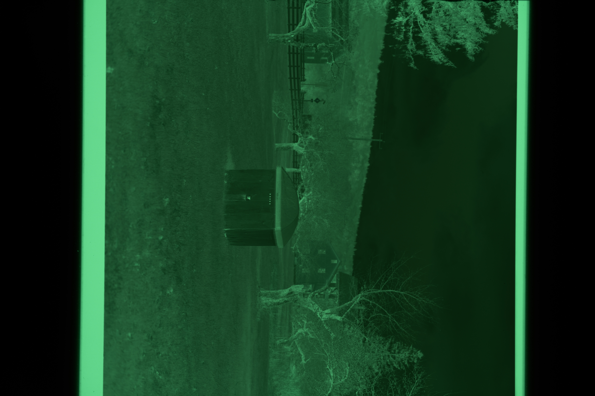
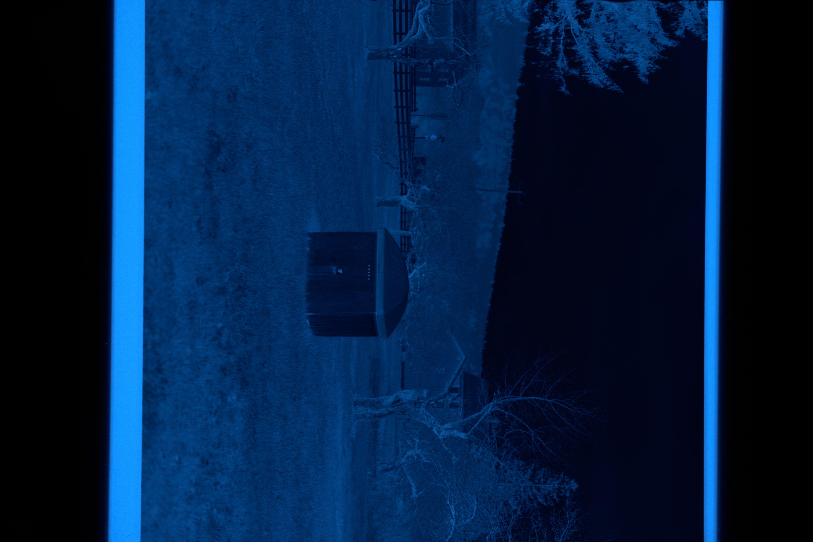

# trichrombine

Single-shot RGB film scanning with Bayer crosstalk correction — trichromatic color quality at single-shot speed.

- [Demo](#demo)
- [Background](#background)
- [Installation](#installation)
- [Workflow](#workflow)
- [Hardware](#hardware)

## Demo

**Converted to positive — before vs. after correction:**

| Before | After |
|--------|-------|
|  |  |

The greens in the field and foliage are noticeably more saturated after correction. Crosstalk was pulling the green channel toward red and blue, desaturating everything.

**Raw negative — before vs. after correction:**

| Before | After |
|--------|-------|
|  |  |

**Raw channel histograms:**

| Before | After |
|--------|-------|
|  |  |

The corrected histogram shows the green channel shifted significantly (less red/blue contamination mixed in), while red and blue tighten up as well.

## Background

For information on the benefits of narrowband scanning over broad spectrum:
- https://jackw01.github.io/scanlight/
- https://medium.com/@alexi.maschas/color-negative-film-color-spaces-786e1d9903a4

### Single-shot vs. trichromatic scanning

The cleanest approach is **trichromatic** (3-shot) scanning: fire only the red LED and capture, then green, then blue, then combine the three frames. Each frame captures one pure channel with no contamination from the others. The drawback is speed and complexity: three exposures per frame, plus alignment and combining in post. For large scanning sessions this is cumbersome.

**Single-shot** scanning fires all three LEDs simultaneously — much faster. The problem is that even narrowband LEDs have some spectral overlap. Red light still registers a small signal in the green and blue photosites. This **Bayer crosstalk** mixes the channels — pulling all three toward each other — and manifests as reduced saturation.

### How crosstalk correction works

The fix: measure the exact crosstalk for this camera + light combination, invert the resulting 3×3 matrix, and multiply the raw pixel values by M⁻¹ before writing the DNG. This undoes the mixing and restores the color separation the sensor should have captured.

Crosstalk is measured by shooting three calibration exposures — one per LED channel, with the other two off — and reading the raw Bayer-level response in all three channel positions for each exposure. These nine values form the crosstalk matrix M; its inverse is the correction.


## Installation

```bash
pipx install git+https://github.com/dzleidig/trichrombine.git
```

This installs three CLI commands: `trichrom-calibrate`, `trichrom-measure-crosstalk`, and `trichrom-correct`.


## Workflow

#### Step 1: Measure crosstalk matrix (one-time)

Shoot three ARW frames with one LED at a time (red-only, green-only, blue-only) against a uniform backlit target. Expose each frame ETTR (as bright as possible without clipping) to maximize signal-to-noise in the off-diagonal channels — the crosstalk signal is weak and needs a clean read. Then measure and save the crosstalk matrix:

```bash
trichrom-measure-crosstalk \
    --red calibrations/RED.ARW \
    --green calibrations/GREEN.ARW \
    --blue calibrations/BLUE.ARW \
    --output calibrations/crosstalk.csv
```

The calibration frames look like this — one LED at a time:

| Red only | Green only | Blue only |
|----------|------------|-----------|
|  |  |  |

The tool prints the measured matrix M and its inverse M⁻¹. Pass the saved CSV to `trichrom-correct` via `--matrix calibrations/crosstalk.csv`. A pre-measured matrix for the Sony A7III + Scanlight is included at `test_images/crosstalk.csv` — if you have the same hardware, you can skip this step and use that directly.

The matrix is a property of the camera + LED hardware, not the film or scene. It stays consistent across different rolls, exposures, and shooting conditions. The only thing that can cause it to vary slightly (~2–3%) is LED temperature, since LEDs shift their spectral output slightly with temperature. In practice, one measurement is good indefinitely for a given camera and Scanlight unit.

#### Step 2: Calibrate LED brightness (per scanning session)

For each new camera setup or lighting condition, run `trichrom-calibrate` to find the optimal per-channel LED brightness. It connects to the Scanlight over USB and triggers captures via Capture One (tethered to the camera), iteratively adjusting R, G, and B independently until each channel is as bright as possible without clipping — ETTR per channel.

```bash
trichrom-calibrate --watch-dir /path/to/captures
```

Output shows the recommended brightness levels to use for scanning:

```
=== Result ===
  --brightness-r 200
  --brightness-g 180
  --brightness-b 210
```

If any channel can't reach the target without the LED maxing out, the tool will prompt you to adjust camera exposure (shutter speed, ISO, or aperture) and retry automatically.

#### Step 3: Capture and correct (per scanning session)

Set the calibrated brightness levels on your Scanlight and start `trichrom-correct` in watch mode. It will automatically correct each ARW as it arrives — just scan normally and the corrected DNGs appear in the output folder:


```bash
trichrom-correct --watch /path/to/captures --output /path/to/dngs --matrix calibrations/crosstalk.csv
```

Processed ARWs are moved to a `processed/` subfolder. Corrected DNGs are written to the output directory (or the same directory if `--output` is not specified).

## Hardware

- Sony A7III (or compatible)
- Scanlight (Raspberry Pi Pico-based LED driver)
- USB serial connection to Scanlight
- Capture One 16+ with Capture One SDK enabled
