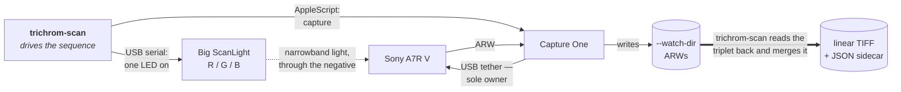
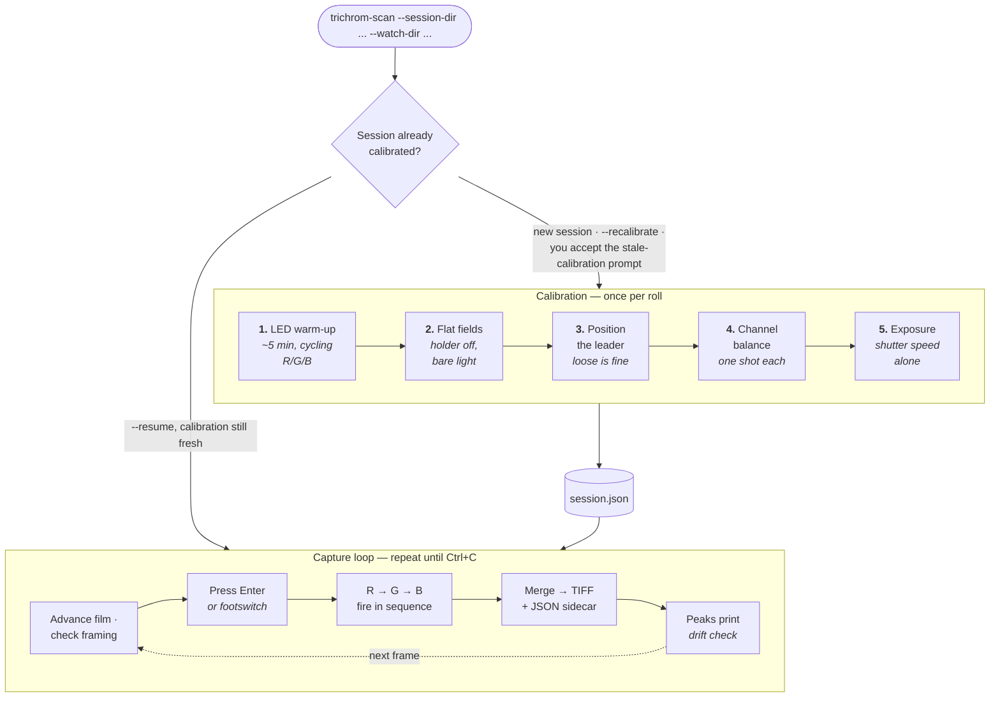

# trichrombine

Trichromatic (3-shot) RGB film scanning for a Scanlight narrowband LED light
source: fire red, green, blue in sequence and merge the clean per-channel
exposures. No crosstalk to correct, since only one narrowband LED is ever on at a
time.

- [Background](#background)
- [Hardware](#hardware)
- [Installation](#installation)
- [Workflow](#workflow)
- [Options](#options)
- [Development](#development)
- [License](#license)

## Background

On the benefits of narrowband RGB scanning over broad spectrum for colour negative:
- https://jackw01.github.io/scanlight/
- https://medium.com/@alexi.maschas/color-negative-film-color-spaces-786e1d9903a4

Three-shot is the cleanest form of it: because each frame is lit by a single
narrowband LED, each captures one pure channel with no spectral overlap to correct.
The cost is speed — three exposures per frame instead of one.

## Hardware

- Sony A7R V, Sigma 105mm f/2.8 DG DN Macro (manual focus, f/8)
- JackW Big ScanLight (narrowband RGB LED, RP2040) over USB serial
- Negative Supply 35mm MK2 holder on a Kaiser RS1 copy stand
- Capture One for tethering, live view and shutter triggering (macOS, AppleScript)


```mermaid
flowchart LR
    T["<b>trichrom-scan</b><br/><i>drives the sequence</i>"]
    SL["Big ScanLight<br/>R / G / B"]
    CAM["Sony A7R V"]
    C1["Capture One"]
    WD[("--watch-dir<br/>ARWs")]
    OUT[("linear TIFF<br/>+ JSON sidecar")]

    T -->|"USB serial:<br/>one LED on"| SL
    SL -.->|"narrowband light,<br/>through the negative"| CAM
    T -->|"AppleScript:<br/>capture"| C1
    C1 -->|"USB tether —<br/>sole owner"| CAM
    CAM -->|"ARW"| C1
    C1 -->|"writes"| WD
    WD ==>|"trichrom-scan reads the<br/>triplet back and merges it"| OUT
```

The thing to notice: **`trichrom-scan` never talks to the camera.** It drives the
light directly over serial, but the shutter goes through Capture One, and the ARWs
come back by watching a folder rather than over any direct connection.

That's deliberate. Capture One owns the camera end to end: it holds the tether for
live view and focus
magnification (focus is set once per session — the lens is focus-by-wire — and never
touched mid-roll), writes the ARWs, and fires the shutter on our behalf via
AppleScript. Sony's PC Remote connection allows one controlling host at a time, so
triggering *through* Capture One rather than alongside it is what keeps live view
available; the ScanLight's own shutter trigger isn't usable on Sony bodies either.

`--camera-backend gphoto2` drives the camera directly instead, as a fallback. It
needs the optional extra (`pip install "trichrom[gphoto]"`), can't share the camera
with a Capture One tether, and gphoto2's Sony support is reverse-engineered per body.

## Installation

```bash
pipx install git+https://github.com/dzleidig/trichrombine.git
```

This installs one CLI command: `trichrom-scan`.

## Workflow

Launch once per roll:

```bash
trichrom-scan --session-dir /path/to/session --watch-dir /path/to/captures \
    --film-stock "Portra 400" --roll-id roll01
```

Merged TIFFs land in `--watch-dir` by default, alongside the ARWs; pass
`--output-dir` to write them somewhere else instead.

One launch covers the whole roll — calibration runs itself if the session needs it,
then you stay in the capture loop until you Ctrl+C:


```mermaid
flowchart TD
    START(["trichrom-scan --session-dir ... --watch-dir ..."]) --> Q{"Session already<br/>calibrated?"}
    Q -->|"new session · --recalibrate ·<br/>you accept the stale-calibration prompt"| CAL
    Q -->|"--resume, calibration still fresh"| LOOP

    subgraph CAL["Calibration — once per roll"]
        direction LR
        C1["<b>1.</b> LED warm-up<br/><i>~5 min, cycling<br/>R/G/B</i>"] --> C2["<b>2.</b> Flat fields<br/><i>holder off,<br/>bare light</i>"] --> C3["<b>3.</b> Position<br/>the leader<br/><i>loose is fine</i>"] --> C4["<b>4.</b> Channel<br/>balance<br/><i>one shot each</i>"] --> C5["<b>5.</b> Exposure<br/><i>shutter speed<br/>alone</i>"]
    end

    CAL --> SAVE[("session.json")]
    SAVE --> LOOP

    subgraph LOOP["Capture loop — repeat until Ctrl+C"]
        direction LR
        L1["Advance film ·<br/>check framing"] --> L2["Press Enter<br/><i>or footswitch</i>"] --> L3["R → G → B<br/>fire in sequence"] --> L4["Merge → TIFF<br/>+ JSON sidecar"] --> L5["Peaks print<br/><i>drift check</i>"]
        L5 -.->|"next frame"| L1
    end
```

The five calibration steps are detailed just below; the capture loop is the part you
actually live in for the rest of the roll.

### Calibration (automatic on a new session)

A brand-new `--session-dir` (or `--recalibrate` on an existing one) runs
calibration before anything else:

1. **LED warm-up** — ~5 minutes by default. LED output drifts as the light comes
   to temperature; calibrating cold and scanning warm means the numbers slide.
   The warm-up cycles R/G/B one channel at a time at `--start-power`, deliberately
   *not* all three at full: scanning only ever has one narrowband LED on, so
   warming hotter than that would settle the board somewhere it never sits in use,
   and the light would cool back toward its real operating point across the roll —
   the same drift, just in the other direction.
2. **Flat fields** — you're prompted to remove the film holder (bare light only).
   One probe frame per channel sets the LED power (shutter speed hasn't been
   chosen yet at this point), then several exposures at that power are averaged
   into a per-channel flat-field map, used to correct light falloff for the rest
   of the session. A flat that comes out clipped or too dark is rejected rather
   than used — either one quietly degrades every frame of the roll.
3. **Leader positioning** — you're prompted to position the roll's own leader
   under the camera. Positioning can be loose: the leader-reading step masks out
   anything that isn't smooth film base, so dust, sprocket holes, and rough
   alignment don't throw it off.
4. **Channel balance** — one exposure per channel at a known starting power. LED
   output is roughly linear with drive current, so the correction is a direct
   ratio computation, not a search: the two stronger channels scale down to match
   the weakest.
5. **Exposure** — with channels balanced, shutter speed alone is adjusted until
   the leader lands at 80-90% of usable range (`white_level - black_level`).

The result — channel levels, shutter speed, flat-field paths — is written to
`session.json` inside `--session-dir`.

### Capture and merge

Once calibrated (or when resuming a session that already is), the tool drops into
the capture loop. Per frame: advance the film, check framing in Capture One's live
view, press Enter (terminal or footswitch). The three exposures fire in sequence,
merge into a linear 16-bit TIFF, and the per-channel peaks print as a drift check —
a light-balance problem shows up on frame one, not after a whole roll.

To resume a previous session instead of starting a new one:

```bash
trichrom-scan --resume --watch-dir /path/to/captures
```

`--resume` reuses the most recently calibrated session (or pass `--session-dir`
explicitly). If that calibration is more than a few hours old, you're asked
whether to redo it rather than it being silently trusted — LED drift or a physical
bump can make old numbers stale. Each merged TIFF gets a JSON sidecar with
calibration numbers, shutter speed, raw peaks, and source filenames.

Only the matching CFA plane is read from each exposure (red from the red-lit shot,
etc. — green averages the two green photosite positions), normalized by
`white_level - black_level`, divided by that channel's flat field, and stacked
into RGB. Unity white balance throughout, no lens/vignetting correction, and no
DCP or camera color matrix — the file stays in sensor space, tagged with a linear
ProPhoto-primaries ICC profile, and color characterization happens downstream in
Capture One on the merged TIFF. Inversion happens in Capture One's Levels while
the data is still linear; gamma encoding happens on export.

### Output resolution

Three-shot capture removes the *spectral* mixing between channels, but not the
*spatial* sparsity of the colour filter array: red is still only measured at a
quarter of the photosites, whichever LED is lit. So there are two honest things to
do with that, and `--resolution` picks between them.

| | `--resolution full` (default) | `--resolution half` |
|---|---|---|
| Output | 9504 × 6336 (60MP) | 4752 × 3168 (15MP) |
| Each pixel | measured where a photosite sat, interpolated between | every value measured, nothing inferred |
| Merge time per frame | ~4s | ~0.6s |

`full` reconstructs each channel from its own measured sites. Because each channel
comes from its own exposure there is no cross-channel contamination to fight, so
this is a cleaner reconstruction than demosaicing a single Bayer frame — but it is
still interpolation, and the extra pixels are inferred rather than measured.

Merge timings are measured on an Apple-silicon Mac, including writing the TIFF
(361MB at full resolution against 90MB at half); a slower machine scales both.
Per-channel drift peaks are read from the measured photosites either way, so they
mean the same thing at both settings and stay comparable across a roll.

`half` is the conservative option: one output pixel per photosite that was really
read. Worth choosing if you want a file where every number came off the sensor, or
if you'd rather not spend the extra merge time. It is not obviously the lesser
choice — at 1:1 on 35mm, 15MP is already around 3350 ppi, which is close to what
400-speed colour negative and an f/8 macro lens (f/16 effective at 1:1) actually
resolve. On slow, fine-grained stock there is more to gain from `full`.

Whichever you use is recorded in the TIFF metadata and the JSON sidecar, so a file
never has to be guessed about later.

## Options

`--watch-dir` is always required, and you need one of `--session-dir` or `--resume`.
Everything else has a working default — `trichrom-scan --help` prints the same list.

### Session and output

| Flag | Default | What it's for |
|---|---|---|
| `--watch-dir DIR` | **required** | Capture One's capture folder, where the ARWs land. Watched to pair each trigger with its file. |
| `--session-dir DIR` | — | Folder holding `session.json` and the flats. Required unless `--resume`. A path that doesn't exist yet starts a new session, which is what triggers calibration. |
| `--resume` | off | Reuse the most recently used session instead of naming one. |
| `--output-dir DIR` | `--watch-dir` | Where merged TIFFs and their sidecars are written. |
| `--film-stock NAME` | empty | Recorded in `session.json` and in every sidecar. |
| `--roll-id ID` | empty | Recorded as above, and used in output filenames — `<roll-id>_0001.tiff`, or `roll_0001.tiff` if unset. |
| `--date DATE` | today | Session date, recorded in state. |
| `--port PORT` | auto-detect | Scanlight serial port. Pass it if detection picks the wrong device. |
| `--camera-backend NAME` | `captureone` | `captureone` or `gphoto2`. See [Hardware](#hardware) for why the default is what it is. |
| `--resolution NAME` | `full` | `full` reconstructs each channel to the sensor's full pixel count; `half` emits one pixel per measured photosite and interpolates nothing. See [Output resolution](#output-resolution). |
| `--recalibrate` | off | Force calibration even on a session that already has it. |
| `--dry-run` | off | Walk the entire flow printing what it would do, touching no hardware. |

### Calibration tuning

Defaults are usually fine.

| Flag | Default | What it's for |
|---|---|---|
| `--start-power N` | `200` | LED power (0-255) for the warm-up cycle and the channel-balance pass. Balance only scales channels *down* from here, so it acts as the ceiling. |
| `--flat-brightness N` | `180` | Starting power for the flat-field probe; the probe then scales it per channel to hit the target exposure. |
| `--flat-shots N` | `6` | Exposures averaged per channel when building each flat. |
| `--skip-flats` | off | Reuse the flats already in the session dir. |
| `--warmup-seconds N` | `300` | How long to cycle R/G/B before calibrating. |
| `--skip-warmup` | off | Skip the warm-up entirely. Reasonable on an already-hot light, not on a cold start. |
| `--max-exposure-iterations N` | `4` | Cap on shutter-refinement passes. Shutter steps are discrete, so it accepts the closest value if it hasn't converged by then. |

### Capture timing

Defaults are usually fine.

| Flag | Default | What it's for |
|---|---|---|
| `--stabilize N` | `0.15` | Seconds between setting the LED and firing — LED settle plus copy-stand vibration. Raise it if the stand rings. |
| `--capture-wait N` | `8.0` | Max seconds to wait for an ARW to appear in `--watch-dir`. Raise it for slow cards or large files. |
| `--shutter-timeout-ms N` | `8000` | Max milliseconds waiting for capture confirmation. `gphoto2` backend only — the Capture One trigger is asynchronous, so the file landing is the signal that matters. |
| `--preview-brightness N` | `32` | White-equivalent (R=G=B) level between frames, so you can see the film while advancing it. |

## Development

```bash
python -m pip install -e ".[dev]"
python -m pytest
```

Tests cover the pure logic — merge math, ICC profile, leader measurement, shutter
selection, flat-field build, session state — and run in under a second with no
hardware. `trichrom-scan --dry-run` walks the whole flow (calibration and capture
loop) without touching the camera or the light. `CLAUDE.md` documents the
architecture and the items still unverified against the rig.

## License

MIT — see [LICENSE](LICENSE).
