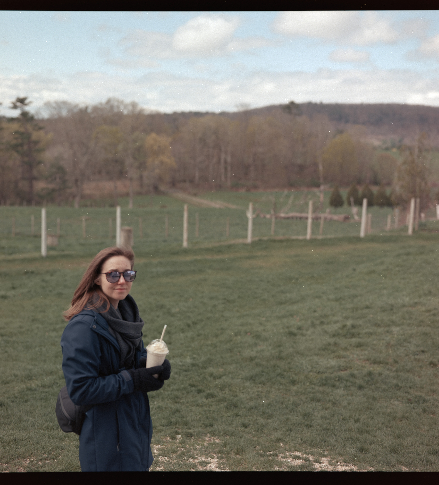
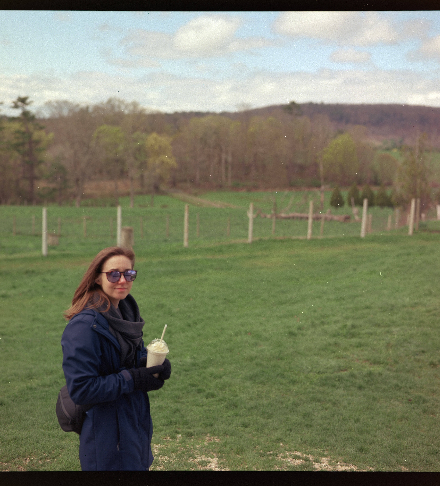
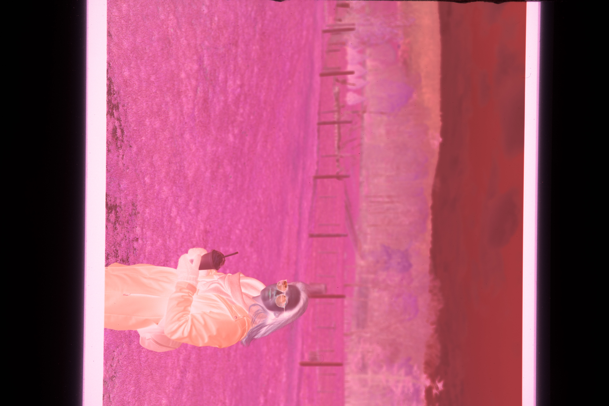
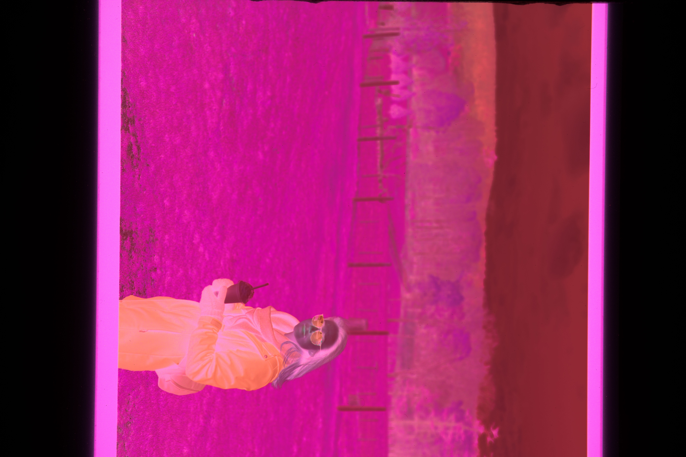
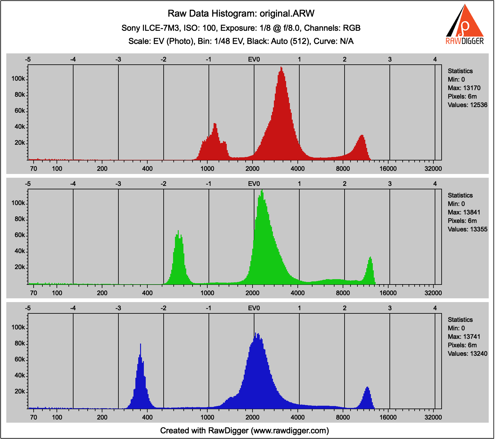
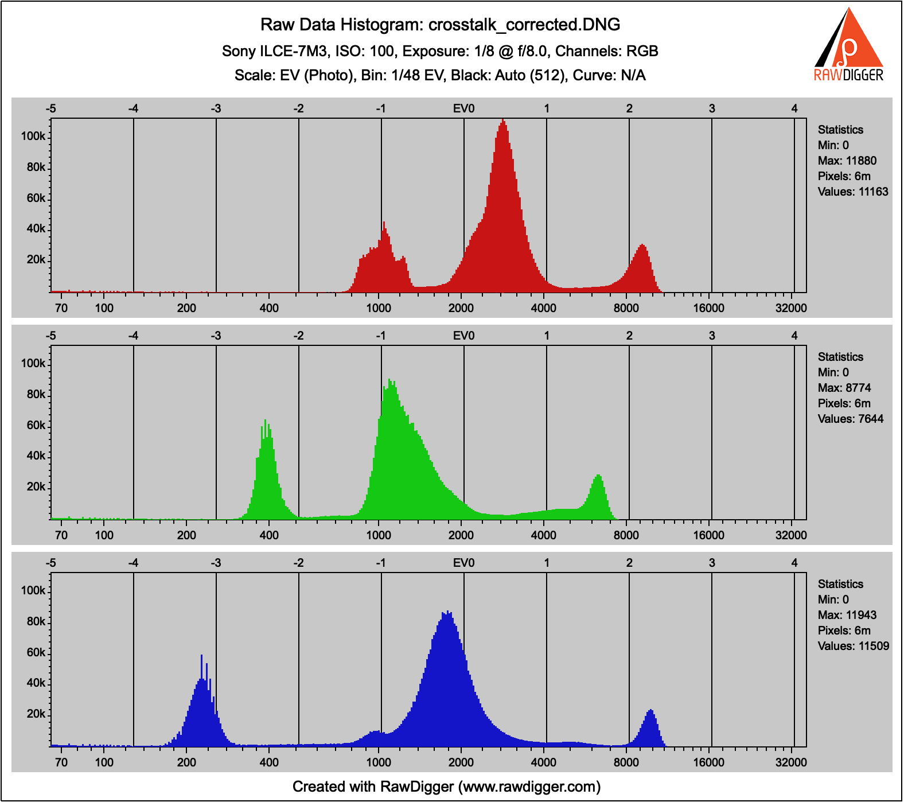
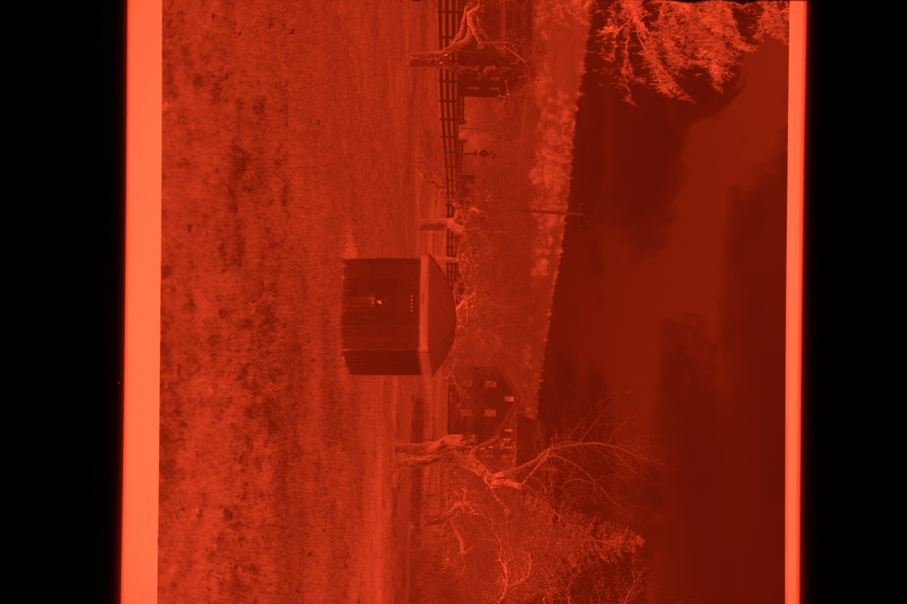
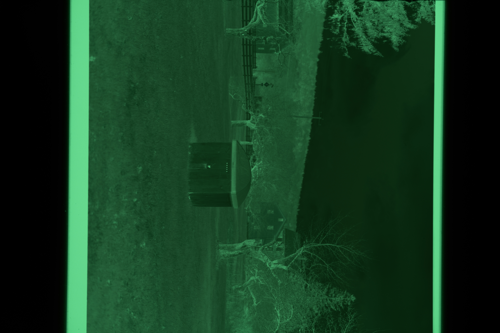
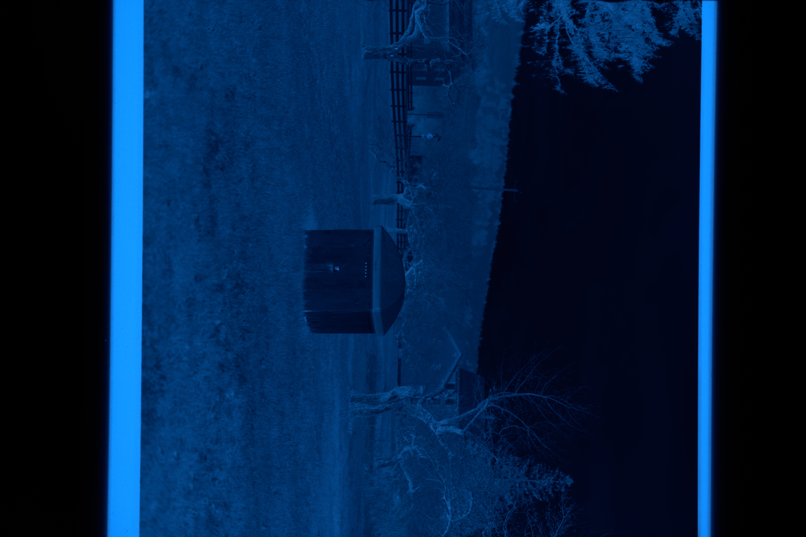

# trichrombine

RGB film scanning tools for a Scanlight narrowband LED light source. The current
workflow is trichromatic (3-shot): fire red, green, blue in sequence and merge
the clean per-channel exposures — no crosstalk to correct, since only one narrowband
LED is ever on at a time. An earlier single-shot workflow (all three LEDs at once,
corrected for LED crosstalk in post) is also still here, for the prior A7III setup.

- [Trichromatic (3-shot) scanning](#trichromatic-3-shot-scanning)
- [Hardware](#hardware)
- [Legacy: single-shot scanning](#legacy-single-shot-scanning)

## Trichromatic (3-shot) scanning

**Camera:** Sony A7R V, tethered to Capture One for live view only (manual focus,
set once per session — the lens is focus-by-wire and never touched mid-roll).
Triggering goes through `gphoto2` directly; Capture One imports whatever lands
regardless of what triggered it. The Scanlight's own shutter trigger isn't usable
on Sony bodies.

### Step 1: Session calibration

Run once per roll, after ~5 minutes of LED warm-up, with the roll's own leader
(base density varies by stock and batch) positioned under the camera — positioning
can be loose, since the leader-reading step masks out anything that isn't smooth
film base.

```bash
trichrom-tri-calibrate --session-dir /path/to/session --watch-dir /path/to/captures \
    --film-stock "Portra 400" --roll-id roll01
```

This captures per-channel flat fields (prompting you to remove the holder first —
bare light only), balances R/G/B LED power from one exposure each (LED output is
roughly linear with drive current, so the correction is a direct ratio computation,
not a search), then adjusts shutter speed alone until the leader lands at 80-90% of
usable range. The result — channel levels, shutter speed, flat-field paths — is
written to `session.json` inside `--session-dir`.

### Step 2: Capture and merge

Launch once per roll. Per frame: advance the film, check framing in Capture One's
live view, press Enter (terminal or footswitch). The three exposures fire in
sequence, merge into a linear 16-bit TIFF, and the per-channel peaks print as a
drift check — a light-balance problem shows up on frame one, not after a whole roll.

```bash
trichrom-tri-capture --resume --watch-dir /path/to/captures --output-dir /path/to/tiffs
```

`--resume` reuses the most recently calibrated session (or pass `--session-dir`
explicitly); a calibration older than a few hours prints a staleness warning rather
than silently trusting numbers that may have drifted. Each merged TIFF gets a JSON
sidecar with calibration numbers, shutter speed, raw peaks, and source filenames.

Only the matching CFA plane is read from each exposure (red from the red-lit shot,
etc. — green averages the two green photosite positions), normalized by
`white_level - black_level`, divided by that channel's flat field, and stacked into
RGB. Unity white balance throughout, no lens/vignetting correction, and no DCP or
camera color matrix — the file stays in sensor space, tagged with a linear
ProPhoto-primaries ICC profile, and color characterization happens downstream in
Capture One on the merged TIFF. Inversion happens in Capture One's Levels while the
data is still linear; gamma encoding happens on export.

## Hardware

- Sony A7R V, Sigma 105mm f/2.8 DG DN Macro (manual focus, f/8)
- JackW Big ScanLight (narrowband RGB LED, RP2040) over USB serial
- Negative Supply 35mm MK2 holder on a Kaiser RS1 copy stand
- Capture One (live view only) + `gphoto2` for tethered triggering

## Legacy: single-shot scanning

The prior workflow, for a Sony A7III triggered via Capture One/AppleScript: all
three LEDs fire simultaneously (fast, one exposure per frame) and the resulting
Bayer crosstalk — narrowband LEDs still have some spectral overlap — is corrected
in post by inverting a measured 3×3 crosstalk matrix. Crosstalk figures measured on
the A7III don't transfer to the A7R V (Sony changed red/yellow sensor response
starting with that body), so this path isn't maintained against current hardware.

- [Demo](#demo)
- [Background](#background)
- [Installation](#installation)
- [Workflow](#workflow)

### Demo

**Converted to positive — before vs. after correction:**

| Before | After |
|--------|-------|
|  |  |

The greens in the field and foliage are noticeably more saturated after correction. Crosstalk was pulling the green channel toward red and blue, desaturating everything.

**Raw negative — before vs. after correction:**

| Before | After |
|--------|-------|
|  |  |

**Raw channel histograms:**

| Before | After |
|--------|-------|
|  |  |

The corrected histogram shows the green channel shifted significantly (less red/blue contamination mixed in), while red and blue tighten up as well.

### Background

For information on the benefits of narrowband scanning over broad spectrum:
- https://jackw01.github.io/scanlight/
- https://medium.com/@alexi.maschas/color-negative-film-color-spaces-786e1d9903a4

### Single-shot vs. trichromatic scanning

The cleanest approach is **trichromatic** (3-shot) scanning: fire only the red LED and capture, then green, then blue, then combine the three frames. Each frame captures one pure channel with no contamination from the others. The drawback is speed and complexity: three exposures per frame, plus alignment and combining in post. For large scanning sessions this is cumbersome.

**Single-shot** scanning fires all three LEDs simultaneously — much faster. The problem is that even narrowband LEDs have some spectral overlap. Red light still registers a small signal in the green and blue photosites. This **Bayer crosstalk** mixes the channels — pulling all three toward each other — and manifests as reduced saturation.

### How crosstalk correction works

The fix: measure the exact crosstalk for this camera + light combination, invert the resulting 3×3 matrix, and multiply the raw pixel values by M⁻¹ before writing the DNG. This undoes the mixing and restores the color separation the sensor should have captured.

Crosstalk is measured by shooting three calibration exposures — one per LED channel, with the other two off — and reading the raw Bayer-level response in all three channel positions for each exposure. These nine values form the crosstalk matrix M; its inverse is the correction.


### Installation

```bash
pipx install git+https://github.com/dzleidig/trichrombine.git
```

This installs `trichrom-calibrate`, `trichrom-measure-crosstalk`, and `trichrom-correct`
(plus `trichrom-tri-calibrate`/`trichrom-tri-capture` for the current trichromatic
workflow, and `trichrom-combine`/`trichrom-capture` for the older AppleScript-triggered
3-shot tools in `legacy/`).

### Workflow

#### Step 1: Measure crosstalk matrix (one-time)

Shoot three ARW frames with one LED at a time (red-only, green-only, blue-only) against a uniform backlit target. Expose each frame ETTR (as bright as possible without clipping) to maximize signal-to-noise in the off-diagonal channels — the crosstalk signal is weak and needs a clean read. Then measure and save the crosstalk matrix:

```bash
trichrom-measure-crosstalk \
    --red calibrations/RED.ARW \
    --green calibrations/GREEN.ARW \
    --blue calibrations/BLUE.ARW \
    --output calibrations/crosstalk.csv
```

The calibration frames look like this — one LED at a time:

| Red only | Green only | Blue only |
|----------|------------|-----------|
|  |  |  |

The tool prints the measured matrix M and its inverse M⁻¹. Pass the saved CSV to `trichrom-correct` via `--matrix calibrations/crosstalk.csv`. A pre-measured matrix for the Sony A7III + Scanlight is included at `test_images/crosstalk.csv` — if you have the same hardware, you can skip this step and use that directly.

The matrix is a property of the camera + LED hardware, not the film or scene. It stays consistent across different rolls, exposures, and shooting conditions. The only thing that can cause it to vary slightly (~2–3%) is LED temperature, since LEDs shift their spectral output slightly with temperature. In practice, one measurement is good indefinitely for a given camera and Scanlight unit.

#### Step 2: Calibrate LED brightness (per scanning session)

For each new camera setup or lighting condition, run `trichrom-calibrate` to find the optimal per-channel LED brightness. It connects to the Scanlight over USB and triggers captures via Capture One (tethered to the camera), iteratively adjusting R, G, and B independently until each channel is as bright as possible without clipping — ETTR per channel.

```bash
trichrom-calibrate --watch-dir /path/to/captures
```

Output shows the recommended brightness levels to use for scanning:

```
=== Result ===
  --brightness-r 200
  --brightness-g 180
  --brightness-b 210
```

If any channel can't reach the target without the LED maxing out, the tool will prompt you to adjust camera exposure (shutter speed, ISO, or aperture) and retry automatically.

#### Step 3: Capture and correct (per scanning session)

Set the calibrated brightness levels on your Scanlight and start `trichrom-correct` in watch mode. It will automatically correct each ARW as it arrives — just scan normally and the corrected DNGs appear in the output folder:


```bash
trichrom-correct --watch /path/to/captures --output /path/to/dngs --matrix calibrations/crosstalk.csv
```

Processed ARWs are moved to a `processed/` subfolder. Corrected DNGs are written to the output directory (or the same directory if `--output` is not specified).

### Hardware

- Sony A7III (or compatible)
- Scanlight (Raspberry Pi Pico-based LED driver)
- USB serial connection to Scanlight
- Capture One 16+ with Capture One SDK enabled
